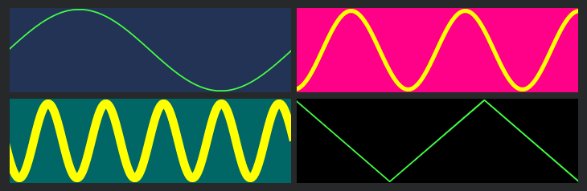

<h1 align="center">⏆<br>&lt;x-plot&gt;</h1>

<p align="center">
a web component that plots zoomable waveforms
</p>

<p align="center">
   <a href="#install">        🔧 <strong>Install</strong></a>
 · <a href="#example">        🧩 <strong>Example</strong></a>
 · <a href="#api">            📜 <strong>API docs</strong></a>
 · <a href="https://github.com/stagas/x-plot/releases"> 🔥 <strong>Releases</strong></a>
 · <a href="#contribute">     💪🏼 <strong>Contribute</strong></a>
 · <a href="https://github.com/stagas/x-plot/issues">   🖐️ <strong>Help</strong></a>
</p>

***

## Install

```sh
$ npm i x-plot
```

Or directly from [jsDelivr](https://www.jsdelivr.com/):

```js
import { PlotElement } from 'https://cdn.jsdelivr.net/gh/stagas/x-plot/x-plot.min.js'

customElements.define('x-plot', PlotElement)
```

## Example

<p align="center"></p>

```html
<x-plot width="200" height="60"></x-plot>
<x-plot width="200" height="60" background="#f08" color="#ff0" zoom="4" line-width="3"></x-plot>
<x-plot width="200" height="60" background="#066" color="yellow" zoom="20" line-width="6"></x-plot>
<x-plot width="200" height="60" background="#000"></x-plot>
```

```js
import { PlotElement } from 'x-plot'

// any name works for the custom element, here: <x-plot>
customElements.define('x-plot', PlotElement)

// then simply put array-like .data on the elements
const plots = container.querySelectorAll('x-plot')

const rate = 44100
const sine = (i, hz) => Math.sin(hz * (i * (1 / rate)) * Math.PI * 2)

plots[0].data = Array(rate)
  .fill(0)
  .map((_, i) => sine(i, 1))
plots[1].data = Array(rate)
  .fill(0)
  .map((_, i) => sine(i, 10))
plots[2].data = Array(rate)
  .fill(0)
  .map((_, i) => sine(i, 100))
plots[3].data = [1, 0, -1, 0, 1, 0, -1]
```

## API

<!-- Generated by documentation.js. Update this documentation by updating the source code. -->

#### Table of Contents

*   [HTMLPlotElement](#htmlplotelement)
    *   [pixelRatio](#pixelratio)
    *   [data](#data)
    *   [zoom](#zoom)
    *   [autoresize](#autoresize)
    *   [lineWidth](#linewidth)
    *   [background](#background)
    *   [color](#color)

### HTMLPlotElement

[src/index.ts:16-31](https://github.com/stagas/x-plot/blob/ee44628f82ef104d66d92f586d1fe092c56c922c/src/index.ts#L16-L31 "Source code on GitHub")

Plot settings.

All values have to be set in the html attribute (or using `setAttribute`).

Camel cased keys can be accessed with their kebab-case name,
i.e lineWidth => line-width

The `data` can only be set directly at the element instance
for example acquiring it through a `querySelector()`.

#### pixelRatio

[src/index.ts:18-18](https://github.com/stagas/x-plot/blob/ee44628f82ef104d66d92f586d1fe092c56c922c/src/index.ts#L18-L18 "Source code on GitHub")

The pixel ratio. Defaults to `window.devicePixelRatio`

Type: [number](https://developer.mozilla.org/docs/Web/JavaScript/Reference/Global_Objects/Number)

#### data

[src/index.ts:20-20](https://github.com/stagas/x-plot/blob/ee44628f82ef104d66d92f586d1fe092c56c922c/src/index.ts#L20-L20 "Source code on GitHub")

Array-like number data to plot

Type: [Array](https://developer.mozilla.org/docs/Web/JavaScript/Reference/Global_Objects/Array)<[number](https://developer.mozilla.org/docs/Web/JavaScript/Reference/Global_Objects/Number)>

#### zoom

[src/index.ts:22-22](https://github.com/stagas/x-plot/blob/ee44628f82ef104d66d92f586d1fe092c56c922c/src/index.ts#L22-L22 "Source code on GitHub")

Zoom amount

Type: [number](https://developer.mozilla.org/docs/Web/JavaScript/Reference/Global_Objects/Number)

#### autoresize

[src/index.ts:24-24](https://github.com/stagas/x-plot/blob/ee44628f82ef104d66d92f586d1fe092c56c922c/src/index.ts#L24-L24 "Source code on GitHub")

Autoresize

Type: [boolean](https://developer.mozilla.org/docs/Web/JavaScript/Reference/Global_Objects/Boolean)

#### lineWidth

[src/index.ts:26-26](https://github.com/stagas/x-plot/blob/ee44628f82ef104d66d92f586d1fe092c56c922c/src/index.ts#L26-L26 "Source code on GitHub")

Line width

Type: [number](https://developer.mozilla.org/docs/Web/JavaScript/Reference/Global_Objects/Number)

#### background

[src/index.ts:28-28](https://github.com/stagas/x-plot/blob/ee44628f82ef104d66d92f586d1fe092c56c922c/src/index.ts#L28-L28 "Source code on GitHub")

Background color

Type: [string](https://developer.mozilla.org/docs/Web/JavaScript/Reference/Global_Objects/String)

#### color

[src/index.ts:30-30](https://github.com/stagas/x-plot/blob/ee44628f82ef104d66d92f586d1fe092c56c922c/src/index.ts#L30-L30 "Source code on GitHub")

Stroke color

Type: [string](https://developer.mozilla.org/docs/Web/JavaScript/Reference/Global_Objects/String)

## Contribute

[Fork](https://github.com/stagas/x-plot/fork) or
[edit](https://github.dev/stagas/x-plot) and submit a PR.

All contributions are welcome!

## License

MIT © 2021
[stagas](https://github.com/stagas)
