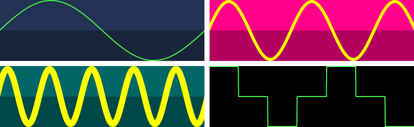
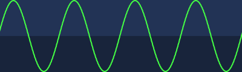

<h1>
x-plot <a href="https://npmjs.org/package/x-plot"></a> <a href="src"></a> <a href="https://cdn.jsdelivr.net/npm/x-plot@2.0.1/dist/x-plot.min.js"></a> <a href="LICENSE"></a>
</h1>

<p></p>

A Web Component that plots zoomable and pannable waveforms.

<h4>
<table><tr><td title="Triple click to select and copy paste">
<code>npm i x-plot </code>
</td><td title="Triple click to select and copy paste">
<code>pnpm add x-plot </code>
</td><td title="Triple click to select and copy paste">
<code>yarn add x-plot</code>
</td></tr></table>
</h4>

## Examples

<details id="example$multiple" title="multiple" open><summary><span><a href="#example$multiple">#</a></span>  <code><strong>multiple</strong></code></summary>  <ul><p></p>  <a href="https://stagas.github.io/x-plot/example/multiple.html"></img>  <p><strong>Try it live</strong></p></a>    <details id="source$multiple" title="multiple source code" ><summary><span><a href="#source$multiple">#</a></span>  <code><strong>view source</strong></code></summary>  <a href="example/multiple.ts">example/multiple.ts</a>  <p>

```ts
import { PlotElement } from 'x-plot'
customElements.define('x-plot', PlotElement)

document.body.innerHTML = /*html*/ `
<div id="demo" style="display:inline-grid;grid:1fr 1fr/1fr 1fr;gap:5px;">
  <x-plot width="200" height="60"></x-plot>
  <x-plot width="200" height="60" background="#f08" color="#ff0" zoom="4" linewidth="3"></x-plot>
  <x-plot width="200" height="60" background="#066" color="yellow" zoom="20" linewidth="6"></x-plot>
  <x-plot width="200" height="60" background="#000"></x-plot>
</div>
`

const plots = document.querySelectorAll('x-plot') as NodeListOf<PlotElement>
const rate = 44100
const sine = (i: number, hz: number) =>
  Math.sin(hz * (i * (1 / rate)) * Math.PI * 2)

plots[0].data = Array(44100).fill(0).map((_, i) => sine(i, 1))
plots[1].data = Array(44100).fill(0).map((_, i) => sine(i, 10))
plots[2].data = Array(44100).fill(0).map((_, i) => sine(i, 100))
plots[3].data = [1, 0, -1, 0, 1, 0, -1]
```

</p>
</details></ul></details><details id="example$web" title="web" open><summary><span><a href="#example$web">#</a></span>  <code><strong>web</strong></code></summary>  <ul><p></p>  <a href="https://stagas.github.io/x-plot/example/web.html"></img>  <p><strong>Try it live</strong></p></a>    <details id="source$web" title="web source code" ><summary><span><a href="#source$web">#</a></span>  <code><strong>view source</strong></code></summary>  <a href="example/web.ts">example/web.ts</a>  <p>

```ts
import { PlotElement } from 'x-plot'
customElements.define('x-plot', PlotElement)

const plot = new PlotElement()
plot.id = 'demo'

document.body.appendChild(plot)

let n = 0
const sine = (i: number, hz: number) =>
  Math.sin(hz * (i * (1 / 1000)) * Math.PI * 2)
const loop = () => {
  requestAnimationFrame(loop)
  plot.data = Array(1000).fill(0).map(_ => sine(++n, 4))
  n += 1000 / 4 / 60 // sampleRate/hz/frameRate to loop video capture every 1 second
}
loop()
```

</p>
</details></ul></details>

## API

<p>  <details id="PlotElement$1" title="Class" open><summary><span><a href="#PlotElement$1">#</a></span>  <code><strong>PlotElement</strong></code>     &ndash; Plot.</summary>  <a href="src/x-plot.ts#L27">src/x-plot.ts#L27</a>  <ul>        <p>  <details id="constructor$3" title="Constructor" ><summary><span><a href="#constructor$3">#</a></span>  <code><strong>constructor</strong></code><em>()</em>    </summary>    <ul>    <p>  <details id="new PlotElement$4" title="ConstructorSignature" ><summary><span><a href="#new PlotElement$4">#</a></span>  <code><strong>new PlotElement</strong></code><em>()</em>    </summary>    <ul><p><a href="#PlotElement$1">PlotElement</a></p>        </ul></details></p>    </ul></details><details id="autoResize$11" title="Property" ><summary><span><a href="#autoResize$11">#</a></span>  <code><strong>autoResize</strong></code>  <span><span>&nbsp;=&nbsp;</span>  <code>false</code></span>   &ndash; Autoresize to fit parent element's size.</summary>  <a href="src/x-plot.ts#L39">src/x-plot.ts#L39</a>  <ul><p>boolean</p>        </ul></details><details id="background$9" title="Property" ><summary><span><a href="#background$9">#</a></span>  <code><strong>background</strong></code>  <span><span>&nbsp;=&nbsp;</span>  <code>'#235'</code></span>  </summary>  <a href="src/x-plot.ts#L36">src/x-plot.ts#L36</a>  <ul><p>string</p>        </ul></details><details id="color$10" title="Property" ><summary><span><a href="#color$10">#</a></span>  <code><strong>color</strong></code>  <span><span>&nbsp;=&nbsp;</span>  <code>'#4f4'</code></span>  </summary>  <a href="src/x-plot.ts#L37">src/x-plot.ts#L37</a>  <ul><p>string</p>        </ul></details><details id="data$14" title="Property" ><summary><span><a href="#data$14">#</a></span>  <code><strong>data</strong></code>     &ndash; Array-like number data to plot, range <code>-1..+1</code>, <code>0</code>=center, <code>-1</code>=bottom, <code>+1</code>=top.</summary>  <a href="src/x-plot.ts#L49">src/x-plot.ts#L49</a>  <ul><p><span>ArrayLike</span>&lt;number&gt;</p>        </ul></details><details id="height$6" title="Property" ><summary><span><a href="#height$6">#</a></span>  <code><strong>height</strong></code>  <span><span>&nbsp;=&nbsp;</span>  <code>60</code></span>  </summary>  <a href="src/x-plot.ts#L33">src/x-plot.ts#L33</a>  <ul><p>number</p>        </ul></details><details id="lineWidth$7" title="Property" ><summary><span><a href="#lineWidth$7">#</a></span>  <code><strong>lineWidth</strong></code>  <span><span>&nbsp;=&nbsp;</span>  <code>1</code></span>  </summary>  <a href="src/x-plot.ts#L34">src/x-plot.ts#L34</a>  <ul><p>number</p>        </ul></details><details id="offsetX$13" title="Property" ><summary><span><a href="#offsetX$13">#</a></span>  <code><strong>offsetX</strong></code>  <span><span>&nbsp;=&nbsp;</span>  <code>0</code></span>   &ndash; Horizontal panning position.</summary>  <a href="src/x-plot.ts#L43">src/x-plot.ts#L43</a>  <ul><p>number</p>        </ul></details><details id="pixelRatio$8" title="Property" ><summary><span><a href="#pixelRatio$8">#</a></span>  <code><strong>pixelRatio</strong></code>  <span><span>&nbsp;=&nbsp;</span>  <code>window.devicePixelRatio</code></span>  </summary>  <a href="src/x-plot.ts#L35">src/x-plot.ts#L35</a>  <ul><p>number</p>        </ul></details><details id="width$5" title="Property" ><summary><span><a href="#width$5">#</a></span>  <code><strong>width</strong></code>  <span><span>&nbsp;=&nbsp;</span>  <code>200</code></span>  </summary>  <a href="src/x-plot.ts#L32">src/x-plot.ts#L32</a>  <ul><p>number</p>        </ul></details><details id="zoom$12" title="Property" ><summary><span><a href="#zoom$12">#</a></span>  <code><strong>zoom</strong></code>  <span><span>&nbsp;=&nbsp;</span>  <code>1</code></span>   &ndash; Zoom scale: <code>1</code>=no zoom.</summary>  <a href="src/x-plot.ts#L41">src/x-plot.ts#L41</a>  <ul><p>number</p>        </ul></details></p></ul></details></p>

## Credits

- [mixter](https://npmjs.org/package/mixter) by [stagas](https://github.com/stagas) &ndash; A Web Components framework.

## Contributing

[Fork](https://github.com/stagas/x-plot/fork) or [edit](https://github.dev/stagas/x-plot) and submit a PR.

All contributions are welcome!

## License

<a href="LICENSE">MIT</a> &copy; 2022 [stagas](https://github.com/stagas)
